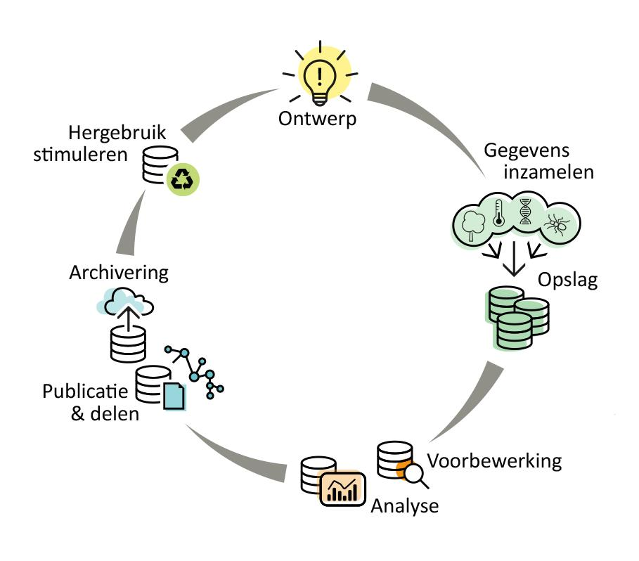

# Bijlage: Uitgebreide omschrijving van de Open Science Doelen {#app:osd-uitgewerkt}

De OSD's worden gegroepeerd volgens de verschillende fasen in de
onderzoekscyclus:

{width="5.9in" height="4.75in"}

Voor het realiseren van een kwaliteitsvolle en transparante onderzoekscyclus is
het, naast het toepassen van relevante OSD's, van belang om de voortgang van het
project en de vlotte doorstroming doorheen de onderzoekscyclus te bewaken.
Tijdens de opmaak van de OSD's werd overwogen om dit expliciet als doelstelling
op te nemen. Dit hangt echter nauw samen met projectbeheer, heeft betrekking op
alle stappen in de onderzoekscyclus en werd uiteindelijk achterwege gelaten. Het
verzekeren van voldoende *resources* voor het kwalitatief en efficiënt uitvoeren
van het onderzoek is uiteraard essentieel om deze OSD's maximaal te kunnen
verwezenlijken. Dit omvat o.a. het verzekeren van voldoende veldmedewerkers voor
het uitvoeren van terreinwerk, het voorzien van afstemming tussen verschillende
initiatieven en het realiseren van een vlotte communicatie tussen alle
medewerkers betrokken bij verschillende stappen in de onderzoekscyclus.

\pagebreak

## ONTWERP {-}

### Relevante vraag {-}

**OSD: De vraagstelling beantwoordt een maatschappelijke en/of
beleidsrelevante informatiebehoefte**

De vraagstelling is goed gekaderd in de wetenschappelijke en beleids- of
praktijkcontext, en haar maatschappelijke relevantie is degelijk getoetst. De
nodige analoge en digitale informatie is daarvoor geraadpleegd (dat kan ook door
een opdrachtgever zijn gebeurd) en de nodige contacten zijn gelegd.

-   Standaard rol van onderzoeksteam:
    -   De problematiek en vraagstelling wordt in een breder maatschappelijk
        kader geplaatst, om zo de onderzoeksvragen relevanter te krijgen.
        Hiervoor wordt uitgebreid overlegd met relevante stakeholders (bv.
        beleidsmakers, opdrachtgevers, beheerders, gemeentebestuur,
        middenveld, experten en geïnteresseerden,\...) en vertegenwoordigers
        uit andere relevante onderzoeksdisciplines (interdisciplinair)
    -   Het uitvoeren van een stakeholderanalyse: wie zijn de relevante
        stakeholders en hoe gaan we hen raadplegen (vorm en frequentie). We
        raadplegen hiervoor een kleine groep stakeholders met een
        helikopterzicht voor de start van het onderzoek. Op deze manier zal
        worden beslist wie er relevante kennis heeft, en wordt een proces
        afgesproken (wie moet wanneer betrokken worden). We maken afspraken om
        de stakeholders ook tijdens het onderzoekstraject te betrekken en
        engageren ons om op basis van hun feedback, waar nodig het
        onderzoekstraject bij te sturen.
    -   De onderzoeksvraag wordt zo optimaal mogelijk afgestemd met wat de
        stakeholders nodig hebben.
    -   Inzicht verwerven in het socio-ecologisch systeem van de vraagstelling
        a.d.h.v. *Soft System Methodology*. Op deze manier wordt er goed
        inzicht verworven in de mogelijk impact van het onderzoek, en de
        mogelijk (on)gewenste neveneffecten.
    -   Opstellen en motiveren van de vraagstelling aan de hand van een
        vraaganalyse (wie heeft welke informatiebehoefte rond het thema) en
        aanbodanalyse (welke gegevens zijn reeds beschikbaar, welke daarvan
        zijn potentieel bruikbaar, welke cruciale informatie moeten we nog
        inzamelen). De inspanning hiervoor staat in verhouding met de grootte
        van het project. Dit kan beknopt voor een beperkt eenmalig experiment
        (1 à 2 A4). Een groot, langlopend project (cfr. meetnetten) vereist
        een uitgebreid hoofdstuk voor zowel de vraaganalyse als de
        aanbodanalyse, op te maken in de beginfase van het project.
    -   De vraagstelling onderbouwen aan de hand van een literatuurstudie.
    -   Documenteren van de totstandkoming van de vraagstelling en het ontwerp,
        daarbij ook motiveren wat niet is opgenomen, en deze documentatie (ook
        voor externen) raadpleegbaar maken
    -   Aftoetsen met de opdrachtgever (kan ook INBO zelf zijn) of de concrete
        vraagstelling een antwoord biedt op de informatiebehoefte.
-   Standaard rol van het managementteam:
    -   Aftoetsen van de relevantie van de vraagstelling
-   Standaard rol van team Natuur en Maatschappij (dit sluit aan bij het (MJP)
    project "(mainstreamen) socio-ecologisch systeemdenken"):
    -   Aanbieden van opleiding/methodologie rond soft system thinking
        (socio-ecologisch systeemdenken) in combinatie met participatieve
        aanpak: Plan wordt opgemaakt in dec 2020; uitrol binnen INBO
        vanaf 2021.
    -   Via socio-ecologisch systeemdenken wordt de vraagstelling (gekaderd in
        een **breder maatschappelijk kader,** aan de hand van bijvoorbeeld een
        systeem-figuur, actoranalyse, causal loop diagram (vb. cognitive
        mapping), ecosysteemdiensten-scan, etc. Door het combineren van de
        resultaten van deze tools kan inzicht verworven worden in een
        specifiek socio-ecologisch systeem, en de plaats die het INBO
        onderzoek hierin kan nemen. Op deze manier worden onderzoeksvragen
        scherper en relevanter en verhoogt de impact op praktijk en beleid.
        Dit proces wordt robuuster in de mate dit met andere disciplines en
        betrokken wordt uitgevoerd (participatief, interdisciplinair en
        deliberatief)
-   Standaard rol van BMK:
    -   Aanreiken van een mogelijke methodologie (cfr.
        [leidraad](https://pureportal.inbo.be/portal/nl/publications/ontwerp-en-evaluatie-van-meetnetten-voor-het-milieu-en-natuurbeleid(11aa46ea-da22-4a3a-a376-08715cba92df).html)
        voor opzetten van meetnetten)
    -   Optreden als klankbord voor het onderzoeksteam
-   Standaard rol van Bibliotheek en Informatiebeheer:
    -   Ervoor zorgen dat de onderzoekers voorzien worden van de nodige
        bronnen - digitaal en analoog - om hun projecten maximaal te kunnen
        onderbouwen met literatuurgegevens en om over zoveel mogelijk gerichte
        informatie te kunnen beschikken (beheren en afsluiten licenties dmv
        consortia, responsabiliseren bij aankoop en collectievorming, ...)

### Communicatieplan {-}

**OSD: De outputs en wijze van communiceren zijn vooraf gedocumenteerd in een
communicatieplan, gedragen door stakeholders**

Er is een **output- en communicatieplan** waarin de soort output(s) en de wijze
van communiceren vooraf wordt gepland.

-   Standaard rol van onderzoeksteam:
    -   Nagaan met welke soort outputs en met welke communicatievormen je je
        onderzoeksresultaten het meeste kan laten doorwerken bij de
        doelgroepen
    -   Afspraken maken met partners en stakeholders:
        i.  wat zien de partners en stakeholders als goede output en
            communicatie;
        ii. wie neemt welke output en communicatie op zich, wat doen we samen
    -   Dubbelchecken of de relevante doelgroep(en) betrokken worden in de
        behoefteanalyse (motivatie vraagstelling)
    -   Voor elke beoogde output documenteren:
        i.  wie de doelgroep(en) zijn;
        ii. nagaan met welke soort output we welk doel willen realiseren
            (doorwerking onderzoeksresultaten verhogen);
        iii. op welke momenten we communiceren (kan bv. ook tussentijds zijn)
    -   Tijdens het verloop van het onderzoeksproject regelmatig het
        communicatieplan erbij nemen en samen met de partners en stakeholders
        evalueren of bijsturing van de outputs en wijze van communiceren
        zinvol is.
-   Standaard rol team Communicatie en Planning:
    -   Klankbordfunctie
    -   Ondersteuning bij het uitwerken van een communicatieplan

### Scherpe vraagstelling {-}

**OSD: De vraagstelling is scherp en helder geformuleerd**

Vraagstelling = wat wil je precies weten? Dit gebeurt vóór het project start of
ten laatste in de beginfase van het project.

-   Standaard rol van onderzoeksteam:
    -   Formuleren van de vraag onder de vorm van een **meetbare hypothese**.\
        Voorbeelden:
        i.  De referentie (nulhypothese) is geen wijziging. Het project moet
            wijzigingen sterker dan +a% of -b% kunnen detecteren.
        ii. De referentie is x m² grondvlak/ha. Het project moet een signaal
            geven (alternatieve hypothese) als het grondvlak kleiner is dan y
            m²/ha of groter dan z m²/ha.
    -   De gewenste informatiekwaliteit (kwantitatief) uitdrukken (zie
        [leidraad](https://pureportal.inbo.be/portal/nl/publications/ontwerp-en-evaluatie-van-meetnetten-voor-het-milieu-en-natuurbeleid(11aa46ea-da22-4a3a-a376-08715cba92df).html)
        voor ontwerp): minimum detecteerbaar effect met bijhorend
        betrouwbaarheidsniveau en power van de statistische toets. Of voor
        schattingen: de maximaal toegelaten foutmarge en het bijhorend
        betrouwbaarheidsniveau.
-   Standaard rol van BMK:
    -   Beschikbaar zijn als klankbord voor het onderzoeksteam
    -   Ondersteunen van het onderzoeksteam bij het formuleren van de vraag als
        een statistische toets.

### Opzet i.k.v. vraagstelling {-}

**OSD: De onderzoeksopzet is afgestemd op de vraagstelling en gedocumenteerd**

De gegevensinzameling en de opzet van analyses worden in samenspraak met de
relevante wetenschapsondersteunende teams uitgewerkt en zijn goed afgestemd op
de vraagstelling.

-   Standaard rol van onderzoeksteam:
    -   Bepalen van de beschikbare en geschikte meettechnieken en methoden
        i.f.v. de informatiebehoefte: veldinventarisatie, sensorennetwerk,
        fotografische beelden, ... en hierbij de mogelijkheden tot
        automatische data-captatie (LIDAR, satelliet, automatische sensoren)
        maximaal overwegen
    -   Opgeven van een indicatieve grootteorde van een realistische
        steekproefgrootte (de hoeveelheid gegevens die verzameld zullen
        worden) in ruimte (locaties) en tijd (frequentie), en de gewenste
        looptijd bepalen
    -   Desgewenst een schaduwmeetnet uitwerken om een beter idee te krijgen van
        de meetfout. Meetfouten betreffen het effect van de waarnemer, het
        meettoestel, het meetobject en het meetprotocol ([Onkelinx et al.
        2010](https://pureportal.inbo.be/portal/nl/publications/schaduwmeetnet-bosinventarisatie(c9b2e18f-82ca-4b08-8b88-7ee306f3a994).html))
    -   Protocollen selecteren of opstellen (voor meer detail: zie OSD i.v.m.
        protocollen)
    -   Bestuderen van mogelijkheden tot validatie: eerstelijns
        kwaliteitscontrole, bv. via invoertoepassingen die dit aanbieden. Maak
        een controlelijst van alle invoerelementen die best ter plaatse al
        gecontroleerd worden: welke velden moeten zeker ingevuld worden, zijn
        de namen (bv. taxa, variabelen) conform een standaardlijst, zijn de
        eenheden conform het protocol, zijn de waarden fysiek mogelijk, e.d.
    -   Op basis van een kosten- en batenanalyse een kosteneffectieve keuze
        maken voor de gegevensinzameling en -analyse. Soms is een beperkt
        aantal dure en precieze metingen het beste. Soms is een groot aantal
        goedkope en ruwere metingen het beste.
    -   Een generieke beschrijving maken van de wijze waarop de informatie
        verwerkt wordt om de hoofdvragen te beantwoorden. Dit kan de
        statistische analyse in generieke termen zijn of een andere
        berekeningswijze.\
        Voorbeelden:
        i.  een linear mixed model met als fixed effects 'jaar' (lineair) en
            'maand' (factor), en 'locatie' als random intercept.
        ii. sommeren van de oppervlakte van alle kadastrale percelen die deel
            uitmaken van een erkend natuurgebied
    -   Aangeven welke tool-chain wordt beoogd om van de ingezamelde data tot
        het resultaat te komen: welke software, welke packages, welke
        infrastructuur zullen op elkaar aansluiten?
    -   Documenteren van alle gemaakte keuzes in de onderzoeksopzet (zie ook DMP
        voor de datagerelateerde elementen).
-   Standaard rol van BMK:
    -   Beoordelen of de opzet een antwoord biedt op de vraag
    -   Ondersteunen van het onderzoeksteam bij het afwegen van verschillende
        methodieken
    -   Aanreiken van vuistregels voor steekproefgrootte
    -   Ruw inschatten of de vooropgestelde steekproefgrootte toelaat om de
        vraag te beantwoorden
    -   (Begeleiden van het onderzoeksteam bij) het uitvoeren van gedetailleerde
        steekproefgrootteberekeningen in de beginfase van het project
-   Standaard rol van laboratorium:
    -   Ondersteunen van het onderzoeksteam bij de kosteneffectiviteit van de
        laboratoriumtaken
    -   Ondersteunen van het onderzoeksteam bij het selecteren van de geschikte
        analysemethoden en variabelen
-   Standaard rol van BMK en laboratorium:
    -   Aanreiken van relevante protocollen en ondersteuning bieden bij
        uitwerken van protocollen
-   Standaard rol van BMK, Databeheer en OSCIBIO:
    -   Ondersteuning bieden en/of kennisuitwisseling stimuleren rond validatie
        in het veld en automatische data-captatie

### Opzet i.k.v. outputs {-}

**OSD: De onderzoeksopzet is afgestemd op de weer te geven
onderzoeksresultaten**

-   Standaard rol van onderzoeksteam:
    -   Een concrete voorafspiegeling van de nodige onderszoeksresultaten maken
        om rekening mee te houden in de onderzoeksopzet:
        i.  welke concrete (essentiële) uitkomsten komen in elke output en op
            welke manier worden zij weergegeven? Voorbeelden: grafiek van Y
            i.f.v. X met betrouwbaarheidsinterval, tabel met effecten en
            p-waarden van de onderzochte predictoren, kaart van variabele Z,
            rangschikking van categorieën volgens een index, \...
        ii. van daaruit terugredeneren om alle voorafgaande stappen te ontwerpen
            (i.h.b.: welke proefopzet, data en analyses zijn nodig?)
-   Standaard rol BMK:
    -   Ondersteuning bij het toepassen van de
        [leidraad](https://pureportal.inbo.be/portal/nl/publications/ontwerp-en-evaluatie-van-meetnetten-voor-het-milieu-en-natuurbeleid(11aa46ea-da22-4a3a-a376-08715cba92df).html)
        voor ontwerp
    -   Klankbordfunctie
    -   Advies over verwerkingsketens

### DMP {-}

**OSD: De verschillende datastappen in de onderzoekscyclus zijn gedocumenteerd
in een Data Management Plan**

De dataketen is beknopt beschreven in een data management plan (DMP).

-   Standaard rol van onderzoeksteam:
    -   Een Data Management Plan (DMP) opmaken, in de aangeleverde sjablonen,
        waarin aandacht is voor alle stappen van de onderzoekscyclus
    -   Aandacht besteden aan de organisatie van projectmappen voor de opslag
        van bestanden
    -   De nood overwegen aan dataversionering en het traceren van datastromen
        in het datamodel
    -   De [FAIR](https://www.go-fair.org/fair-principles/) principes
        (Findable, Accessible, Interoperable, Re-usable) nastreven
    -   De afweging maken om de data als open data te publiceren en de
        beslissing hierover opnemen in het DMP
    -   Het gebruik van GBIF en Zenodo als infrastructuur voor *"publish first
        (open), analyse later"* overwegen
-   Standaard rol van Databeheer, OSCIBIO en Bibliotheek en Informatiebeheer :
    -   Aanreiken van standaard DMP sjabloon en advisering rond gebruik ervan.
    -   Het opmaken van DMP's promoten
    -   Aanbieden en ondersteunen van het gebruik van het
        [DMPOnline.be](https://dmponline.be/) platform voor het
        uitwerken en delen van DMP's.
    -   Advies verlenen en verwijzen naar referentiemateriaal en richtlijnen
        relevant voor het opstellen van DMP's, o.a. rond data management,
        datastandaarden en licenties.
    -   Kritisch nazicht van DMP's, in het bijzonder met betrekking tot
        vereisten voor data-invoer en opslag, het documenteren van de data
        (metadatering), gebruikte datastandaarden en plannen rond
        dataontsluiting.
    -   Aanbevelingen aanreiken voor de organisatie van projectmappen (cfr.
        cookiecutter-data-science)
    -   Actief opvolgen van de opmaak DMP's voor projecten gefinancierd met
        Vlaamse middelen in het kader van de FOSB streefdoelen. Communiceren
        van richtlijnen omtrent DMP's vanuit de FOSB.
    -   Publiceren van afgewerkt DMP (pdf) in CRIS-systeem (Current Research
        Information System e.g. PURE)
-   Standaard rol van BMK:
    -   Advies over de bruikbaarheid van het dataformaat voor de analyse.
    -   Advies over de ontsluiting van de analyseresultaten.

### Revisiestadia {-}

**OSD: Revisiestadia zijn voorzien (langlopende cases)**

-   Standaard rol van onderzoeksteam:
    -   Tijdens de uitvoering worden stadia voorzien om het projectontwerp
        (incl. DMP, communicatieplan) te evalueren en te herwerken indien
        nodig
    -   Ook het output- en communicatieplan, waarin de soort output en de wijze
        van communiceren staan, wordt opnieuw geëvalueerd en waar nodig
        bijgestuurd. Dit omvat:
        -   Voor elke output herevalueren: 1) wie de doelgroep(en) zijn; 2) met
            welke soort output we welk doel we willen realiseren (impact
            onderzoek verhogen); 3) op welke momenten we communiceren
        -   De gemaakte afspraken met partners en stakeholders herevalueren: 1)
            wat zien de partners en stakeholders als goede output en
            communicatie en 2) wie neemt welke output en communicatie op zich,
            wat doen we samen
-   Standaard rol BMK, Databeheer, Communicatie en Planning, Natuur &
    Maatschappij, Bibliotheek & Informatiebeheer, Laboratorium, OSCIBIO:
    -   Aanbieden methodologie (zie voorgaande OSD's)
    -   Klankbordfunctie

\pagebreak

## GEGEVENSINZAMELING {-}

### Protocollen gebruiken {-}

**OSD: De gegevensinzameling verloopt volgens protocollen**

De gegevensinzameling volgt zoveel mogelijk bestaande, op INBO overeengekomen
standaardmethoden, bv. voor terreinwerk, laboratoriumactiviteiten, enquêtering,
... Afwijkingen hierop worden goed gemotiveerd.

-   Standaard rol van onderzoeksteam:
    -   Indien relevant: helder formuleren van gevraagde functionaliteiten voor
        (mobiele) gegevensinvoer en pro-actief de mogelijkheden hierrond
        aftoetsen met team Databeheer.
    -   De gegevensinzameling (metingen, bemonstering, transport,
        staalvoorbehandeling) gebeurt op basis van een gestandaardiseerd INBO
        veld- of projectprotocol.
    -   Bij gebrek aan een geschikt veld- of projectprotocol werkt het
        onderzoeksteam er één uit. Wanneer een bestaand protocol om
        gefundeerde redenen niet bruikbaar is: het bestaande protocol
        actualiseren of een nieuwe variant uitwerken.
    -   De praktische haalbaarheid en efficiëntie van het veldwerk bewaken in
        protocollen
    -   Terugkoppelen over verbetermogelijkheden en knelpunten bij het toepassen
        van protocollen
    -   Meewerken aan testcases meettechnieken en protocollen
-   Standaard rol van BMK:
    -   Aanreiken van een sjabloon en platform voor veld- en projectprotocollen
    -   Centralisatie van veld- en projectprotocollen
    -   Testcases meettechnieken en protocollen met veldmedewerkers organiseren,
        om na te gaan wat in de praktijk écht werkt
-   Standaard rol van laboratorium:
    -   Uitvoeren van kwaliteitsvolle analysen op watermonsters en vaste
        monsters volgens afgesproken en voorgeschreven methodieken.
    -   Onderzoeksteam ondersteunen bij hun veldactiviteiten door het aanleveren
        van de nodige materialen voor bemonstering en de conservering van
        monsters.
    -   Onderzoeksteam ondersteunen bij het uitvoeren van metingen (pH, ...) op
        het terrein door het aanleveren van gekalibreerde apparatuur en het
        geven van een opleiding.
    -   Onderzoeksteam ondersteunen bij het voorbehandelen van vaste monsters
        volgens afgesproken standaarden.
-   Standaard rol van Databeheer:
    -   Ondersteunen van de uitwerking, ontwikkeling en/of implementatie van
        (mobiele) applicaties voor gegevensinvoer.
    -   Het bewaken van de optimale inzet van bestaande tools voor (mobiele)
        gegevensinvoer en advisering rond mogelijke opties bij vragen naar
        dergelijke tools.

### Automatische data-inzameling {-}

**OSD: Automatische datainzameling wordt ingezet**

-   Standaard rol van onderzoeksteam:
    -   Instaan voor het opstarten en opvolgen van automatische datainzameling
-   Standaard rol van Databeheer, OSCIBIO:
    -   Ondersteuning bieden bij technische aspecten m.b.t. automatische
        datainzameling, bvb. het configureren van communicatie tussen sensoren

### Bestaande data gebruiken {-}

**OSD: Bestaande, bruikbare data (desgevallend monsters) worden benut**

Er wordt goed overwogen of reeds eerder ingezamelde datasets benut kunnen worden
(hergebruik van data). Er wordt overwogen of monsters uit het bodemarchief
bruikbaar zijn voor heranalyse.

-   Standaard rol van onderzoeksteam:
    -   bereidheid om bij te leren over het gebruik van hieronder vermelde
        systemen.
-   Standaard rol van OSCIBIO:
    -   technisch advies over gebruik van open data systemen (GBIF, iNaturalist,
        Waterinfo, etc.)
-   Standaard rol van Bibliotheek en Informatiebeheer:
    -   centraal aanbieden van open data (metadata) via CRIS-systeem (Current
        Research Information System e.g. PURE)
-   Standaard rol van Databeheer:
    -   wegwijs maken van onderzoekers in centraal beheerde databases en
        datasystemen door te verwijzen naar bestaande documentatie of het
        bieden van ad-hoc ondersteuning.

### Valideren tijdens datainzameling {-}

**OSD: Validatieprocedures tijdens gegevensinzameling worden toegepast**

-   Standaard rol van onderzoeksteam:
    -   Instaan voor de toepassing van validatieprocedures (zie OSD 'De
        onderzoeksopzet is afgestemd op de vraagstelling en gedocumenteerd')
-   Standaard rol BMK, Databeheer, OSCIBIO:
    -   Ondersteuning bieden en/of kennisuitwisseling stimuleren rond validatie
        in het veld en automatische data-captatie

### Meetfout kennen {-}

**OSD: Bij de gegevensinzameling is de meetfout gekend**

Er wordt bewust omgegaan met aspecten van meetonzekerheid.

-   Standaard rol van onderzoeksteam:
    -   Bij de gegevensverzameling op het terrein worden voldoende herhalingen
        uitgevoerd om de variabiliteit te kunnen inschatten en de totale
        meetonzekerheid bij het verzamelen van gegevens te kunnen bepalen.
    -   Desgewenst wordt een schaduwmeetnet uitgerold om de meetfout beter in
        beeld te brengen (zie OSD 'De onderzoeksopzet is afgestemd op de
        vraagstelling en gedocumenteerd')
-   Standaard rol van BMK:
    -   Ondersteuning in het ontwerp (zie OSD 'De onderzoeksopzet is afgestemd
        op de vraagstelling en gedocumenteerd')
-   Standaard rol van laboratorium:
    -   Opstellen van een kwaliteitssysteem voor het uitvoeren van labometingen.
    -   Realiseren van accreditatie voor analysemethoden nodig voor onderzoek.
    -   Realiseren van erkenning voor analysemethoden nodig voor onderzoek.
    -   Valideren van analyseresultaten op niveau van het monster, i.s.m. het
        onderzoeksteam.
    -   Onderzoeksteam ondersteunen bij het bekomen van accreditatie voor
        bemonstering, transport en conservering van monsters, en bij het
        voorbehandelen van vaste monsters.

\pagebreak

## OPSLAG VAN DATA {-}

### Gepaste data-opslag {-}

**OSD: De data zijn op een degelijke manier opgeslagen**

Er is aandacht voor de methoden van data-opslag en voor de metadatering hiervan.
De methode van data-opslag is afgestemd op de grootte van de dataset.

-   Standaard rol van onderzoeksteam:
    -   Aangeven van de noden naar data-opslag en metadatering naar Databeheer,
        bij voorkeur gebeurt dit al in de fase van opmaak van het
        datamanagementplan
    -   De data worden onverwijld ingevoerd in het datasysteem zoals
        gedefinieerd in het datamanagementplan.
    -   Respecteren en waar nodig actualiseren van afspraken en documentatie
        rond definities databankvelden in samenspraak met Databeheer.
    -   Een DMP hanteren om een betere organisatie van data te realiseren
    -   Verzorgen van vlotte en coherente data invoer, volgens geldende
        afspraken
    -   Specifieke aandacht besteden aan het opslaan van gevoelige, sociale
        en/of kwalitatieve persoonlijke data, bewaken van vertrouwelijkheid,
        rekening houden met de algemene verordening gegevensbescherming (GDPR)
-   Standaard rol van Databeheer:
    -   Verzekeren van robuuste datamodellen bij het uitwerken van centrale
        databanken.
    -   Documenteren van datamodellen, inclusief definiëring van databankvelden
        (gevalideerde versus niet-gevalideerde data), beschrijving van codes,
        etc.
    -   Samenbrengen van gegevens uit diverse databanken in datawarehouses met
        het oog op efficiënte bevraging door de onderzoekers.
    -   Bewaken dat de data opgeslagen en/of ontsloten worden op een manier die
        snelle consultatie (ook in het veld, bvb. in functie van validatie) en
        integratie met andere datasets (e.g. in centrale databank/dataportaal)
        toelaat.
    -   Instaan voor beheer van gebruikers, gebruikerstoegang en
        informatiebeveiliging.
    -   Waar voorhanden algoritmes voor het automatiseren van kwaliteitscontrole
        en versionering van data implementeren in de datasystemen
    -   Specifieke aandacht besteden aan het opslaan van gevoelige, sociale
        en/of kwalitatieve persoonlijke data, bewaken van vertrouwelijkheid,
        rekening houden met de algemene verordening gegevensbescherming (GDPR)
    -   Desgewenst versionering voorzien op niveau van de databank
-   Standaard rol van laboratorium:
    -   Centraliseren van analyseresultaten in het LIMS
    -   Kwaliteitsvol beschikbaar stellen van de gegevens in een datawarehouse.

## VOORBEWERKING VAN DATA {-}

### Data valideren {-}

**OSD: De data worden op een herhaalbare manier gevalideerd**

Er wordt datavalidatie uitgevoerd, de werkwijze wordt gedocumenteerd en is
(liefst) reproduceerbaar.

-   Standaard rol van onderzoeksteam:
    -   Opstellen van eenvoudige univariate validatieregels.\
        Voorbeelden:
        i.  Aantallen mogen niet negatief zijn.
        ii. De stijghoogte in peilbuizen moet tussen -10 m en +2 m t.o.v.
            maaiveld liggen.
    -   Kritisch nakijken van alle metingen die als anomalie gecatalogeerd
        worden.
-   Standaard rol van BMK:
    -   Aanreiken van methodieken om anomalieën in de data te detecteren op
        basis van de statistische modellen die gebruikt worden bij de
        verwerking van de gegevens.
-   Standaard rol van Databeheer:
    -   Streven naar implementatie van eenvoudige univariate validatieregels in
        centrale databanken en invoerapplicaties.
    -   Ernaar streven dat elke observatie een validatiestatus krijgt die
        verschillende waarden kan aannemen:
        i.  Niet gecontroleerd: geen actie ondernomen
        ii. Anomalie: afwijkende observatie volgens een statistisch model, nog
            geen verdere actie ondernomen
        iii. Gevalideerd: observatie is grondig nagekeken door een domeinexpert
             en goedgekeurd
        iv. Afwijkend: de meting zelf is correct maar wijkt af van de normale
            situatie. De meting kan niet voor alle doeleinden gebruikt worden.
            Bijvoorbeeld: hoogte van een boom met afgebroken top.
        v.  Afgekeurd: deze meting is volgens een domeinexpert onbruikbaar
    -   Kwaliteitscontrole van GIS-data: controle op topologie, "data
        coherentie",\...
-   Standaard rol van laboratorium:
    -   Ondersteuning van de onderzoeksteams bij het valideren van
        analyseresultaten op niveau van het project en de locatie.
    -   Aanreiken van de prestatiekenmerken (detectielimiet, herhaalbaarheid,
        reproduceerbaarheid) van analysemethoden om een inschatting te maken
        van de gevoeligheid en variabiliteit van de metingen.
    -   Ondersteuning van de onderzoeksteams bij het bepalen van de
        meetonzekerheid bij het volledig proces voor verzamelen van
        veldgegevens.

### Reproduceerbaar voorbewerken {-}

**OSD: De voorbewerking van data gebeurt reproduceerbaar**

De stappen om van ruwe data naar analyseerbare data te gaan, zijn goed
gedocumenteerd en reproduceerbaar: bv. SQL-script, R-script, rapport met
gegevensbewerking in Rmarkdown formaat, \...

-   Standaard rol van onderzoeksteam:
    -   Bereidheid om bij te leren over een gescripte data-workflow
    -   Gebruik maken van reproduceerbare scripts om data voor te bewerken
-   Standaard rol van BMK:
    -   Voorzien van opleiding en ondersteuning over databewerking met behulp
        van R
-   Standaard rol van OSCIBIO:
    -   Technisch advies (in de vorm van voorbeelden) over het gestandaardiseerd
        opzetten van een bestand/mappenstructuur voor voorverwerking van data.

\pagebreak

## ANALYSE {-}

### Data exploreren {-}

**OSD: Er gebeurt een degelijke data-exploratie**

De onderzoeker voert een adequate en reproduceerbare data-exploratie uit in
functie van de analyse.

-   Standaard rol van onderzoeksteam:
    -   Alle data grondig en kritisch verkennen vooraleer te starten met een
        analyse.
-   Standaard rol van BMK:
    -   Opleiding voorzien rond data-exploratie

### Gepast analyseren {-}

**OSD: De analyse is adequaat en correct**

De analyse is adequaat voor de doelstelling en gebeurt correct.

-   Standaard rol van onderzoeksteam:
    -   Analyse uitvoeren die minstens de oorspronkelijke vragen beantwoordt.
    -   De resultaten van de analyse kritisch beoordelen.
    -   Organiseren van validatie (peer review) van de analyse (bvb. door te
        werken met pull-requests in GitHub waarbij persoon die niet
        rechtstreeks betrokken is bij de analyse gevraagd wordt om de broncode
        na te kijken)
-   Standaard rol van BMK:
    -   Opleiding voorzien zodat de onderzoeksteams zelfstandig basisanalyses
        kunnen uitvoeren
    -   Helpdeskondersteuning voor de onderzoeksteams bij de analyses
    -   Uitvoeren van meer geavanceerde analyses, na voorafgaande afspraken bij
        de start van het project.
-   Standaard rol van Databeheer (GIS):
    -   Ondersteuning bij het uitvoeren van GIS-analyses (zowel technisch als
        methodologisch)
    -   Uitvoeren van meer complexe analyses en ontwikkelen van gespecialiseerde
        geoprocessing tools, modellen of applicaties
    -   Kwaliteitscontrole van geospatiale resultaatbestanden: controle op
        topologie, "data coherentie",\...

### Reproduceerbaar analyseren {-}

**OSD: De analyseworkflow is open en reproduceerbaar**

De workflow voor de analyse is open en reproduceerbaar: bv. rapport met analyse
in Rmarkdown-formaat.

-   Standaard rol van onderzoeksteam:
    -   De analyse is maximaal gebaseerd op scripts met de nodige documentatie.
    -   Onderdelen die manueel dienen te gebeuren, worden in detail beschreven.
    -   De verwerking gebeurt maximaal met behulp van vrije open-source
        software.
-   Standaard rol van BMK en OSCIBIO:
    -   Voorzien van opleiding en ondersteuning voor het gebruik van R en
        Rmarkdown.
    -   Voorzien van opleiding en ondersteuning voor het reproduceren van de
        analyse-omgeving (package-versies, R-versie, versies van back-end
        libraries en besturingssysteem).

### Versiebeheer {-}

**OSD: Versies van de gebruikte data, broncode en analyse worden bijgehouden**

Bij elke publicatie wordt verwezen naar een specifieke versie van de data en de
analysestappen om de resultaten te reproduceren. Deze versies worden
gearchiveerd zodat we er op een later tijdstip naar kunnen teruggrijpen.

-   Standaard rol van onderzoeksteam:
    -   Bereidheid om bij te leren en gebruik te maken van GitHub.
    -   De geanalyseerde data met een vorm van versiebeheer bewaren.
    -   Liefst ook de geselecteerde ruwe data en de scripts met de
        voorbewerkingsstappen met een vorm van versiebeheer bewaren
        (reproduceerbaarheid van de geanalyseerde data)
    -   Scripts voor analyse met een vorm van versiebeheer bewaren.
    -   Bij de rapportage vermelden welke versie van data en scripts gebruikt
        werd.
    -   Gebruiken van de mogelijkheden tot digitale samenwerking en reviewing in
        versiebeheersystemen (via *pull requests* in GitHub)
    -   Indien van toepassing: software versioneren (Docker)
-   Standaard rol van BMK, OSCIBIO en Databeheer:
    -   Voorzien van opleiding en ondersteuning voor het gebruik van
        versiebeheer voor data en scripts.
    -   Voorzien van opleiding en ondersteuning voor het reproduceren van de
        gebruikte ruwe data of analysedata, voor de gevallen waar de data niet
        mee opgenomen zijn bij het versiebeheer van de broncode (bv. Zenodo,
        databanken).

\pagebreak

## PUBLICATIE & DELEN {-}

### Gepast intepreteren {-}

**OSD: De resultaten worden in de gepaste context geïnterpreteerd**

In een publicatie worden de resultaten besproken in de context van de
*vraagstelling* en in de context van de *bestaande, relevante wetenschappelijke
informatie*.

-   Standaard rol van onderzoeksteam:
    -   In de bespreking van de resultaten de verantwoordelijkheid nemen om een
        goede afstemming te bereiken met de vraagstelling en om de relevante
        informatie te betrekken.
-   Standaard rol van Bibliotheek en Informatiebeheer:
    -   Ervoor zorgen dat de onderzoekers voorzien worden van de nodige
        bronnen - digitaal en analoog - om hun projecten maximaal te kunnen
        onderbouwen met literatuurgegevens en om over zoveel mogelijk gerichte
        informatie te kunnen beschikken (beheren en afsluiten licenties via
        consortia, responsabiliseren bij aankoop en collectievorming, ...)
    -   Ondersteuning bij gebruik bibliotheekdatabanken en
        referentiebeheersystemen (Endnote, Zotero, ...)

### Open data {-}

**OSD: De data zijn open**

Gegevens worden, in principe, publiek beschikbaar (open data).

-   Standaard rol van onderzoeksteam:
    -   Het onderzoeksteam maakt een afweging i.v.m. het publiceren van de data,
        waarbij zoals aangegeven in het
        [Opendatabeleid](https://www.inbo.be/nl/opendatabeleid) het
        publiceren als Open Data het standaard uitgangspunt is. Deze afweging
        wordt publiek gemaakt. Tulloch et al (2018)
        [https://doi.org/10.1038/s41559-018-0608-1](https://doi.org/10.1038/s41559-018-0608-1)
        is hierbij een bruikbaar afwegingskader.
    -   Het onderzoeksteam zorgt voor de publicatie van de data.
-   Standaard rol van OSCIBIO:
    -   Technisch advies over keuze van dataformaat, metadata en een geschikt
        platform voor het publiek stellen van onderzoeksdata. Voor
        data-publicatie naar GBIF biedt dit team ook ondersteuning.
    -   Actief opvolgen van de publicatie van data in het algemeen. Voor de
        opvolging vanuit de FOSB wordt specifiek de nadruk gelegd op data
        geassocieerd met wetenschappelijke artikels die voortvloeien uit
        projecten gefinancierd met Vlaamse middelen, maar het INBO streeft
        aanvullend naar het open mobiliseren van onderzoeksdata in het
        algemeen.
-   Standaard rol van Databeheer:
    -   Aanmaken en publiceren metadata via het Geopunt-metadatacenter
        (ontsluiten van geografische gegevens in Vlaanderen). De (GIS-)data
        worden op die manier ontsloten via de Geopunt-catalogus en de "Vlaamse
        Open Data"-catalogus
    -   Publiceren van GIS-lagen conform met de OGC (Open Geospatial Consortium)
        standaard web services (WMS, WFS,\...)
    -   Ontwikkelen van een (apart) geoloket voor de gepubliceerde GIS-data
-   Standaard rol van Bibliotheek en Informatiebeheer:
    -   Open data en koppeling met publicaties en projecten verzekeren
    -   Ontsluiten van resultaatdata die geassocieerd zijn met een
        wetenschappelijk artikel (datadryad, etc)
    -   Centraal aanbieden van open data (metadata) via CRIS-systeem (Current
        Research Information System e.g. PURE)

### FAIR principes {-}

**OSD: De FAIR principes (Findable, Accessible, Interoperable, Re-usable)
worden toegepast**

Deze OSD is complementair met voorgaande "De data zijn open" en beide worden
vaak samen toegepast. De FAIR-principes vormen een [set van
richtlijnen](https://www.go-fair.org/fair-principles/) die ook toegepast
kunnen worden voor gegevens die niet volledig publiek toegankelijk zijn.

-   Standaard rol van onderzoeksteam:
    -   Implementeren van FAIR principes
-   Standaard rol van Databeheer en OSCIBIO:
    -   Promoten en ondersteuning bieden bij het implementeren van de FAIR
        principes
    -   Zorgen voor vlotte toegankelijkheid en vindbaarheid door het opstellen
        van een overzicht van beschikbare datasets en data
    -   Opvolgen van de ontwikkeling van het FOSB streefdoel rond FAIR data

### Open broncode {-}

**OSD: De broncode is open**

Broncode wordt, in principe, publiek beschikbaar (open source).

-   Standaard rol van onderzoeksteam:
    -   De finale versies van de scripts en documentatie worden in principe
        publiek gemaakt onder een open licentie zodat deze ook hergebruikt
        kunnen worden door derden ([https://opensource.org/licenses,
        https://choosealicense.com/](https://opensource.org/licenses)).
    -   Bereidheid tot gebruik van GitHub.
    -   Toepassen van richtlijnen voor het beschikbaar maken van broncode.
-   Standaard rol van OSCIBIO:
    -   Technisch advies over hoe broncode publiek beschikbaar te stellen
    -   Beheren van richtlijnen voor het beschikbaar maken van broncode (o.a.
        licensing)

### Open protocollen {-}

**OSD: De protocollen zijn open**

Protocollen (veldprotocollen, laboprotocollen, ...) worden publiek beschikbaar
(open protocols).

-   Standaard rol van onderzoeksteam:
    -   Aanleveren van de protocols in een open formaat
-   Standaard rol van BMK:
    -   Ontsluiten van de protocols via een website.
    -   Uitwerken van een formaat dat vlot bij te werken is door de
        onderzoeksteams en vlot online publiceerbaar is
    -   Opleiden van de onderzoeksteams voor het schrijven van de protocols in
        een open formaat
-   Standaard rol van laboratorium:
    -   Aanleveren van de protocols in een open formaat

### Open publicaties {-}

**OSD: De publicaties zijn open**

De publicaties worden volgens het INBO [open access
beleid](https://www.inbo.be/nl/openaccess-beleid) publiek beschikbaar
gesteld.

-   Standaard rol van onderzoeksteam:
    -   Ter beschikking stellen van publicaties aan team Bibliotheek en
        Informatiebeer of zelf invoeren in CRIS-systeem (Current Research
        Information System e.g.
        [PURE](https://www.elsevier.com/solutions/pure))
-   Standaard rol van Bibliotheek en Informatiebeheer:
    -   Voor A1: open access journal (green of gold): Begeleiden en ondersteunen
        bij nieuwe vormen van publiceren (bv. onderzoekers ondersteunen in de
        keuze om te publiceren in een openaccess-tijdschrift uit de Directory
        of Open Access Journals (DOAJ)), overgang naar Open Access en de
        nieuwe administratieve en juridische eisen die daarbij spelen. Open
        Access van minstens de post-print in de institutionele repository.
    -   Outputs (publicaties, projecten, datasets, activiteiten) worden
        gecentraliseerd publiek beschikbaar (CRIS-systeem) gesteld en
        gesynchroniseerd met externe systemen (projectendatabank Jira,
        personeelsdatabank, adviezenapplicatie) wordt voorzien
    -   Uitbreiden aanbod aan kanalen voor de verspreiding van INBO-publicaties
        (INBO-website, FRIS, OpenAIRE, ...)
    -   Uitbouwen van Expert Portal (via de INBO-website)
    -   Koppelen en integreren van wetenschappelijke informatie aan de bij de
        gebruikers populaire onderzoeksinformatiesystemen (citatieanalyse,
        altmetrics, fingerprinting, ...)
    -   Stimuleren van publicatie in Open Access journals (green of gold) in
        samenwerking met de FOSB data steward, stimuleren van het publiceren
        in non-hybride journals

### Outputs citeren {-}

**OSD: Er wordt in de publicaties naar de verschillende outputs gerefereerd**

DOI, of de Digital Object Identifier
([https://www.doi.org](https://www.doi.org)), is een systeem voor het
identificeren van content in een digitale omgeving. Digitale documenten of
objecten kunnen in de loop van de tijd veranderen van inhoud of van plaats.
Omdat de DOI-naam ongewijzigd blijft kan een object blijvend geïdentificeerd
worden.

Een ORCID iD ([https://orcid.org](https://orcid.org)) is een unieke,
persistente identifier voor onderzoekers. Ze laat toe om onderzoekers eenduidig
te identificeren over aanstellingen en instellingen heen, en om de diverse
vormen van output (publicaties, peer reviews, datasets) aan de onderzoeker te
linken.

-   Standaard rol van onderzoeksteam:
    -   Waar relevant de referenties (met DOI) van verschillende gerelateerde
        outputs zoals dataset, data paper, projecten, gepubliceerd protocol,
        broncode (op Zenodo) opnemen
    -   Aanmaken van ORCID iD en deze opnemen in CRIS-systeem (Current Research
        Information System e.g.
        [PURE](https://www.elsevier.com/solutions/pure))
    -   Opnemen van ORCID iD in publicaties
-   Standaard rol Bibliotheek en Informatiebeheer:
    -   Maximaal aantal INBO-publicatietypes (adviezen, rapporten, mededelingen,
        \...) voorzien van een DOI
    -   Bewaken dat DOIs van outputs mee opgenomen worden in PURE en relevante
        links en relaties gelegd worden in PURE.

### Kwalitatieve vormgeving {-}

**OSD: De publicaties worden kwaliteitsvol vormgegeven**

De outputs worden conform de huisstijl, op een aantrekkelijke wijze gelay-out en
vormgegeven.

-   Standaard rol van onderzoeksteam:
    -   Werken volgens de opgestelde procedures
-   Standaard rol van Bibliotheek en Informatiebeheer (samen met Communicatie &
    Planning):
    -   Bewaken, ontwikkelen en onderhouden van een uniforme huisstijl
    -   Ontwerpen en uitvoeren van de lay-out voor de INBO-communicatiemiddelen
        en het grafisch vormgeven van PR-materiaal
    -   Invoeren en actualiseren van grafische bestanden en bijhouden van een
        grafisch klassement
    -   Leveren van kwaliteitsvolle publicaties
    -   Uitbouw en beheer fototheek
-   Standaard rol van BMK:
    -   Aanleveren en onderhouden van een huisstijl voor het RMarkdown formaat.
    -   Opleiden van onderzoeksteams bij het gebruik van de huisstijl in
        RMarkdown.
    -   Aanleveren en onderhouden van een huisstijl voor ggplot2-grafieken
    -   Opleiden van onderzoeksteams bij het gebruik van de huisstijl in
        ggplot2.
-   Standaard rol van Bibliotheek & Informatiebeheer + BMK
    -   Onderhoud van de INBO-citatiestijlbestanden (o.a. het
        [gedeponeerde](https://github.com/citation-style-language/styles/blob/master/research-institute-for-nature-and-forest.csl)
        stijlbestand research-institute-for-nature-and-forest.csl)

### Methoden communiceren {-}

**OSD: Er wordt over de outputs en daarbij gebruikte (Open Science) methoden
gecommuniceerd**

-   Standaard rol van onderzoeksteam:
    -   Aandacht besteden aan de communicatie rond toegepaste methoden om de
        kwaliteit en transparantie van het onderzoek te waarborgen
-   Standaard rol Communicatie en Planning:
    -   Klankbordfunctie

\pagebreak

## ARCHIVERING {-}

### Documenten archiveren {-}

**OSD: Alle afgewerkte en gebruikte documenten worden duurzaam bewaard en
efficiënt ontsloten**

Er gebeurt een geïntegreerd archiefbeheer op basis van een
Informatiebeheersplan. Alle archiefdocumenten worden duurzaam bewaard, efficiënt
ontsloten en ter beschikking gesteld conform het archiefdecreet van 9 juli 2010
en andere wettelijke bepalingen. Bijkomend wordt ook een op lange termijn
betrouwbare en doorzoekbare archivering van de data, stalen, protocollen en
broncode toegepast (Zenodo, Open Science Framework (OSF), PURE, etc.), conform
het nog verder uit te werken INBO-beleid rond archivering (van zowel analoog als
digitaal materiaal).

-   Standaard rol van onderzoeksteam:
    -   Officiële documenten bezorgen aan verantwoordelijke dienst (op basis van
        de selectielijst in het Informatiebeheersplan)
    -   Relevante projectdocumenten bezorgen
-   Standaard rol van Bibliotheek en Informatiebeheer:
    -   Opstellen van een Informatiebeheersplan en selectielijsten
    -   Bewaren of vernietigen van documenten
    -   Deponering bij het Rijksarchief
    -   Deponering archief VAC, depot Vilvoorde
    -   Duurzaam archiveren (en ontsluiten) van onderzoeksarchieven

### Data archiveren {-}

**OSD: Data worden gearchiveerd**

-   Standaard rol van onderzoeksteam:
    -   Data aanreiken voor archivering
-   Standaard rol van Databeheer/IT-Operaties:
    -   Opzetten en bieden van technische ondersteuning voor
        databank-archivering in eigen beheer
-   Standaard rol van Bibliotheek en Informatiebeheer:
    -   Voorzien van duurzame opslag en digitale bewaring van informatie

### Stalen archiveren {-}

**OSD: Stalen worden gearchiveerd**

-   Standaard rol van onderzoeksteam:
    -   Archiveren van vaste monsters zodat deze herbruikbaar zijn voor latere
        metingen in het laboratorium en nieuwe bemonsteringen op het terrein
        worden vermeden
-   Standaard rol van laboratorium:
    -   Ondersteuning bij archivering van vaste monsters
-   Standaard rol wetenschapsondersteunende teams:
    -   Verkennen van mogelijke samenwerking met externe partners voor het
        kwaliteitsvol archiveren van stalen

### Protocollen archiveren {-}

**OSD: Protocollen worden gearchiveerd**

-   Standaard rol van onderzoeksteam:
    -   Toepassen van richtlijnen rond archivering van protocollen
-   Standaard rol van wetenschapsondersteunende teams:
    -   Verkennen van mogelijkheden en opstellen van richtlijnen voor
        archivering van protocollen

### Broncode archiveren {-}

**OSD: Broncode wordt gearchiveerd**

-   Standaard rol van onderzoeksteam:
    -   Toepassen van richtlijnen rond archivering van broncode
-   Standaard rol van wetenschapsondersteunende teams:
    -   Verkennen van mogelijkheden en opstellen van richtlijnen voor
        archivering van broncode

\pagebreak

## HERGEBRUIK STIMULEREN {-}

### Hergebruik stimuleren {-}

**OSD: Intern en extern hergebruik krijgt alle kansen**

Er wordt een inspanning geleverd om gebruikte systemen, data, broncode en
documentatie (o.a. protocollen) zo goed mogelijk te laten renderen voor het INBO
en extern:

-   bekendheid creëren, vindbaarheid verhogen en hergebruik stimuleren
-   bij aanvang van projecten nagaan welke bestaande data, workflows,
    opslagsystemen gebruikt kunnen worden
-   voor regelmatig terugkerende taken een eenmalige inspanning doen om
    hergebruik te vergemakkelijken (en indien mogelijk te automatiseren)
-   Standaard rol van onderzoeksteam:
    -   Onderzoeken welke data / broncode reeds beschikbaar is vooraleer zelf
        nieuwe dingen in te zamelen of te ontwikkelen.
    -   Alles wat gepubliceerd wordt van de nodige metadata en documentatie
        voorzien opdat het voor anderen makkelijker te vinden is.
-   Standaard rol van Bibliotheek en Informatiebeheer:
    -   Ontsluiten van de 'outputs'
    -   Coördinerende rol bij metadatering en ontsluiting door onderzoekers

